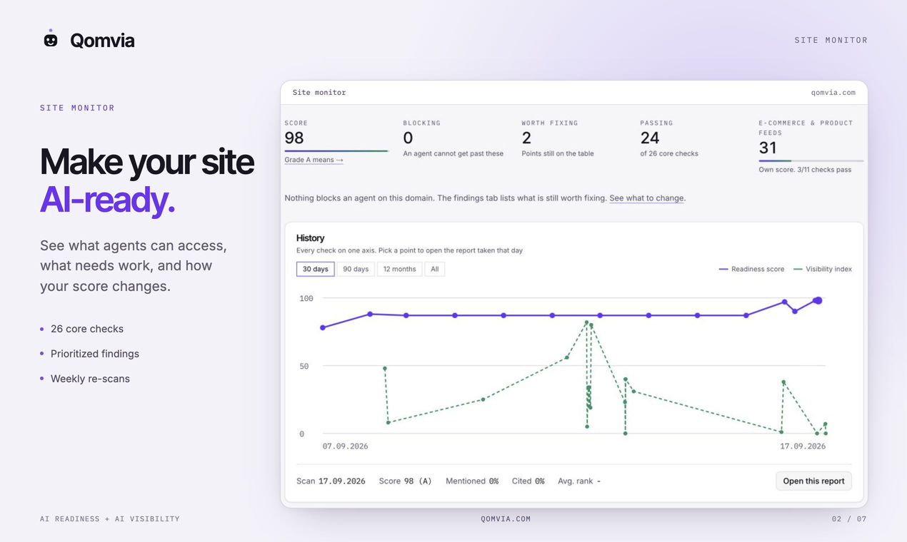
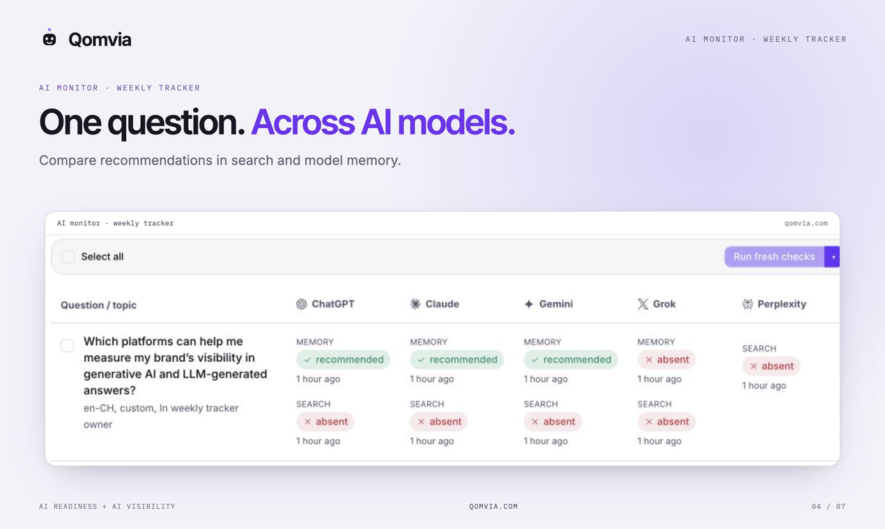
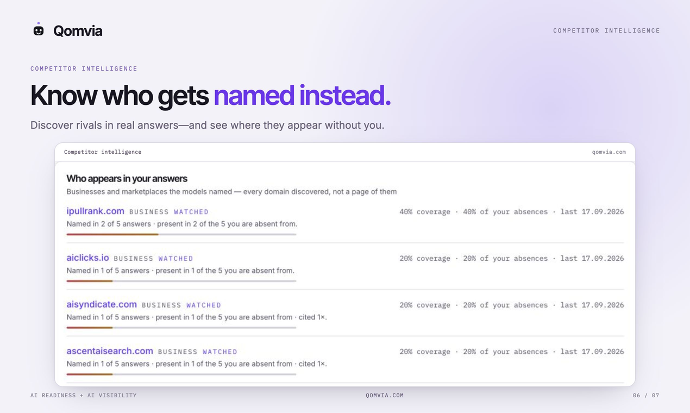

<p align="center">
  
</p>

<h1 align="center">Qomvia</h1>

<p align="center">
  <strong>Get read, named and bought by AI agents.</strong><br/>
  Agent-readiness scoring, AI brand monitoring and agentic checkout — over REST, MCP and QMP.
</p>

<p align="center">
  <a href="https://qomvia.com"></a>
  <a href="https://qomvia.com/api/mcp"></a>
  <a href="LICENSE"></a>
</p>

## What is Qomvia?

AI agents are becoming how people shop and research — but most websites were built for humans with browsers. Qomvia measures how ready your site is for that shift, tracks what the major AI models actually say about your brand, and gives agents a real way to buy from you:

- **Agent-readiness score** — 26 checks on your public HTTP responses, graded 0–100 / A–F on one published rubric. Free, no sign-up: every scanned site gets a public page like `qomvia.com/site/<slug>`.
- **AI monitor** — asks ChatGPT, Gemini and Grok the questions your buyers ask, then records whether you're named, cited — or a rival is. Weekly, per question.
- **Qomvia Market** — product search built for agents: signed offers with agent pricing, and checkout that always settles on the **merchant's own payment page**. Qomvia never touches the money.

Everything public is readable by humans *and* machines — as HTML, JSON, plain text (`/llms.txt`) or MCP.

<p align="center">
  
  
  
</p>
<p align="center"><sub>Site monitor · AI monitor across models · Competitor intelligence</sub></p>

## MCP server

One streamable-HTTP endpoint, no key required:

```
https://qomvia.com/api/mcp
```

```sh
claude mcp add --transport http qomvia https://qomvia.com/api/mcp
```

```json
{"mcpServers":{"qomvia":{"url":"https://qomvia.com/api/mcp"}}}
```

10 tools in two groups — **buy** (`search_products`, `get_offer`, `extend_offer`, `create_checkout_session`, `get_checkout_session`, `complete_checkout`, `cancel_checkout_session`) and **check** (`get_ai_readiness_score`, `scan_website`, `list_readiness_checks`).

Full tool reference: [mcp/README.md](mcp/README.md) · Registry descriptor: [server.json](server.json) · Discovery: [`/.well-known/mcp.json`](https://qomvia.com/.well-known/mcp.json)

## REST API

The same surface over plain HTTP — `POST /api/v1/market/search` finds ranked, signed offers across every listed shop; `/api/scan` scores any domain.

```sh
curl -X POST https://qomvia.com/api/v1/market/search \
  -H 'content-type: application/json' \
  -d '{"q":"bike helmet","shipTo":"CH","qty":1}'
```

Endpoint reference: [api/README.md](api/README.md) · Schema: [openapi.json](api/openapi.json) · Docs: [qomvia.com/api/docs](https://qomvia.com/api/docs)

| Limit | Anonymous | Agent key (`qva_…`) |
| --- | --- | --- |
| Searches | 20 / minute | 300 / minute |
| Checkouts | 10 / minute | 120 / minute |
| Fresh scans | One per domain per hour | One per domain per hour |

Get a key: [qomvia.com/.well-known/auth.md](https://qomvia.com/.well-known/auth.md)

## QMP — the merchant side

The Qomvia Market Protocol is how a shop answers agent orders: publish `/.well-known/qomvia.json`, accept signed (HMAC) order calls at `/qomvia/orders`, and the buyer pays on **your** checkout. Four endpoints — create, read, list, cancel — plus a conformance runner in this repo.

| Tier | Integration | Ranking |
| --- | --- | --- |
| Feed only | Feed, coupon CSV and redirect template — no code | Listed |
| Adapter | Shopify, WooCommerce or Shopware creates the order | Ranked above feed-only |
| QMP native | Your shop answers agents directly | Ranked first at equal price |

Merchant fees: 5% per confirmed order; the first 10 are free.

Spec: [qmp/SPEC.md](qmp/SPEC.md) · Reference shop + conformance runner: [qmp/](qmp/)

## Links

- [qomvia.com](https://qomvia.com) — free score, live leaderboard
- [MCP server page](https://qomvia.com/mcp) · [QMP](https://qomvia.com/qmp) · [Methodology](https://qomvia.com/methodology)
- [OpenAPI](https://qomvia.com/openapi.json) · [Agent skills](https://qomvia.com/.well-known/agent-skills/index.json) · [llms.txt](https://qomvia.com/llms.txt)

## License

MIT. Copyright © 2026 Qomvia.
