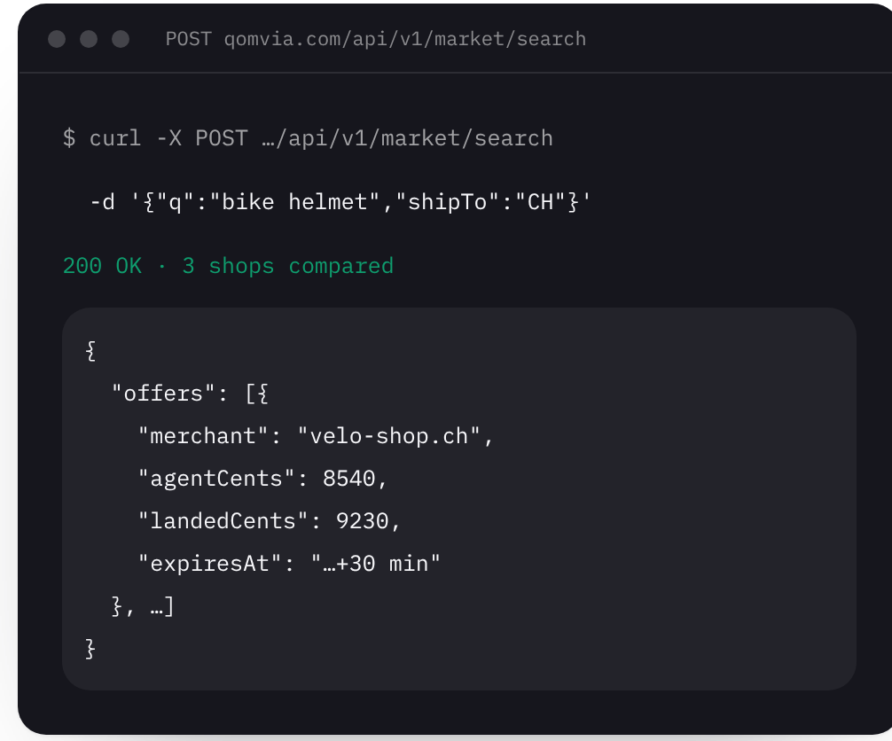
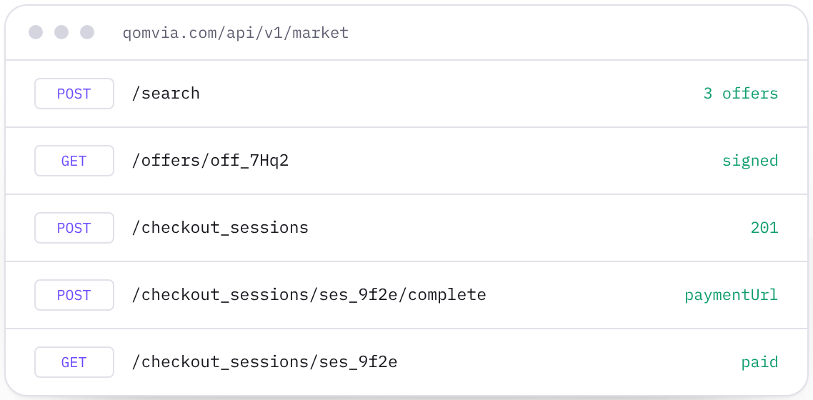
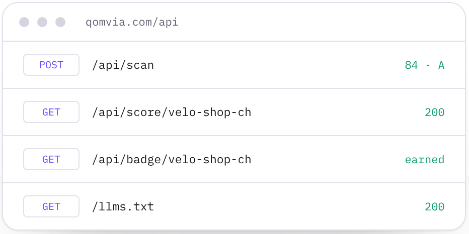

<p align="center">
  
</p>

<h1 align="center">Qomvia REST API</h1>

<p align="center">
  <strong>Let your agent buy anything, and score any website, in plain JSON.</strong><br/>
  <a href="#quick-start">Quick start</a> ·
  <a href="#market">Market</a> ·
  <a href="#scores">Scores</a> ·
  <a href="#limits">Limits</a> ·
  <a href="openapi.json">OpenAPI</a>
</p>

<p align="center">
  
</p>

## Quick start

No key needed. Base URL: `https://qomvia.com`

```sh
curl -X POST https://qomvia.com/api/v1/market/search \
  -H 'content-type: application/json' \
  -d '{"q":"bike helmet","shipTo":"CH","qty":1}'
```

You get ranked, signed offers from every listed shop, held for 30 minutes. Open a checkout session on one and hand the buyer the merchant's payment link.

## Market

<table>
  <tr>
    <td width="50%"></td>
    <td width="50%" valign="top">
      <b>Search → offer → checkout → pay</b>
      <ol>
        <li>Search ranked offers.</li>
        <li>Read or extend the offer.</li>
        <li>Open a checkout session.</li>
        <li>Complete it for the payment URL.</li>
        <li>The buyer pays on the merchant's own checkout.</li>
      </ol>
    </td>
  </tr>
</table>

| Method | Endpoint | What it does |
| --- | --- | --- |
| `POST` | `/api/v1/market/search` | Find ranked, signed offers from listed shops. |
| `GET` | `/api/v1/market/offers/{id}` | Read an offer, prices, terms and expiry. |
| `POST` | `/api/v1/market/offers/{id}/extend` | Extend an offer once by 30 minutes. |
| `POST` | `/api/v1/market/checkout_sessions` | Open a checkout session on an offer. |
| `GET` | `/api/v1/market/checkout_sessions/{id}` | Read a session and its order state. |
| `POST` | `/api/v1/market/checkout_sessions/{id}/complete` | Return the merchant-hosted payment URL. |
| `POST` | `/api/v1/market/checkout_sessions/{id}/cancel` | Cancel an open session. |

## Scores

<table>
  <tr>
    <td width="50%"></td>
    <td width="50%" valign="top">
      <b>Score any domain</b>
      <p>26 read-only checks, graded 0–100 and A–F. Every scanned site gets a public page at <code>qomvia.com/site/&lt;slug&gt;</code>.</p>
    </td>
  </tr>
</table>

```sh
curl -s -X POST https://qomvia.com/api/scan \
  -H 'content-type: application/json' \
  -d '{"domain":"example.com"}'
```

| Method | Endpoint | What it does |
| --- | --- | --- |
| `POST` | `/api/scan` | Scan a website read-only; cached for one hour per domain. |
| `GET` | `/api/score/{slug}` | Read the latest published score and check statuses. |
| `GET` | `/api/badge/{slug}` | Read seal markup or `{ "earned": false }`. |
| `GET` | `/llms.txt` | Read the machine-readable service description. |

## Limits

| Request | Anonymous | Agent key (`qva_…`) |
| --- | --- | --- |
| Market searches | 20 per minute | 300 per minute |
| Market checkouts | 10 per minute | 120 per minute |
| Fresh scans | One per domain per hour | One per domain per hour |

An optional `Authorization: Bearer qva_…` agent key raises Market limits. [How to get one](https://qomvia.com/.well-known/auth.md).

## Your own sites and monitors

Site monitor, AI monitor, competitor and Product monitor tools for your account live on the [account MCP server](../mcp/README.md#account-server).

---

[qomvia.com/api/docs](https://qomvia.com/api/docs) · [OpenAPI schema](openapi.json) · [MCP servers](../mcp/README.md) · [QMP spec](../qmp/SPEC.md)
