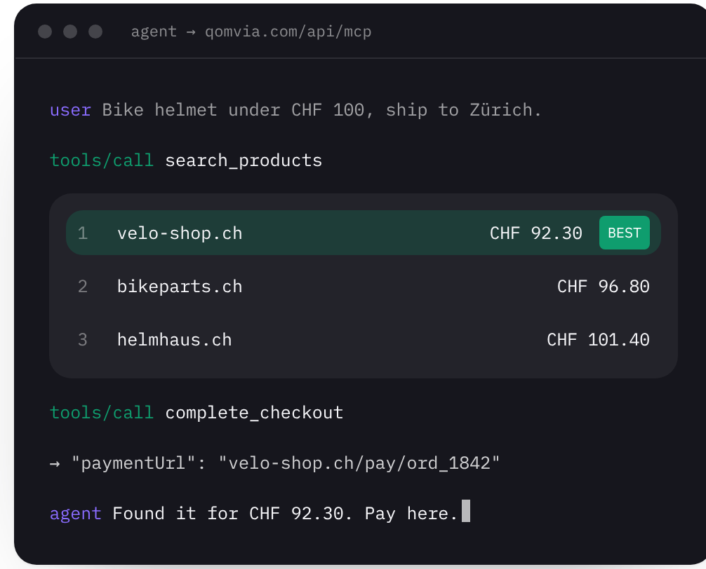
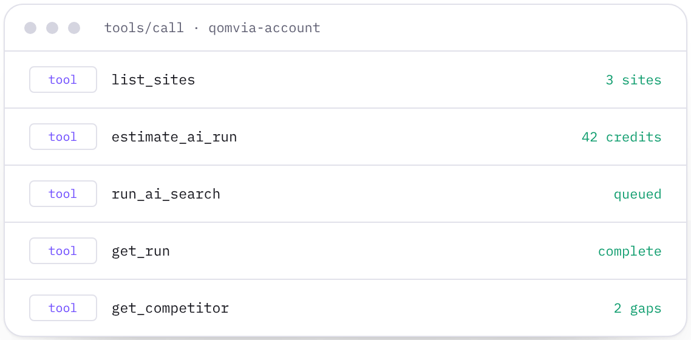
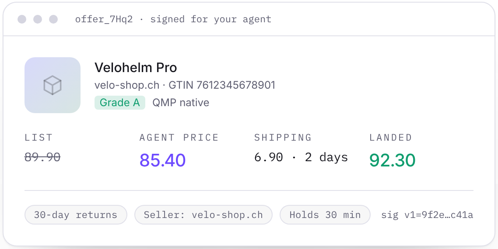
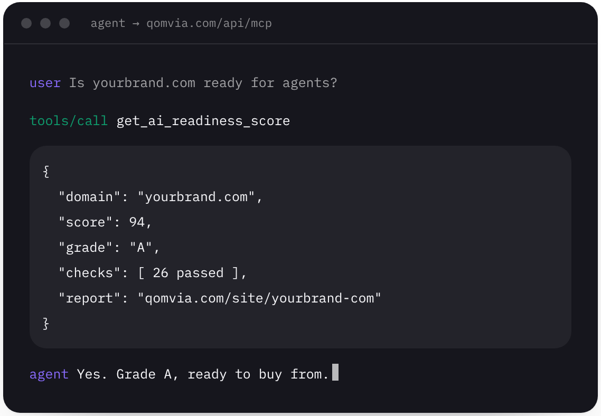
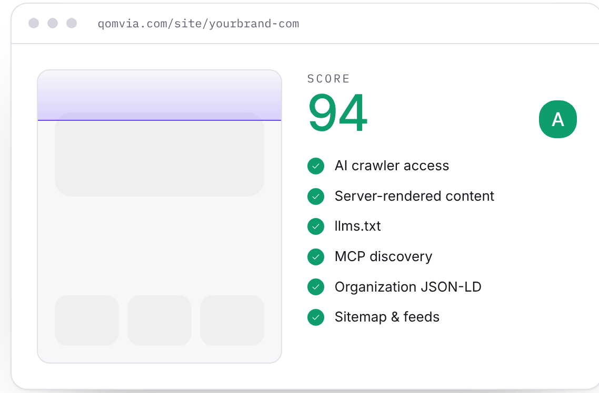
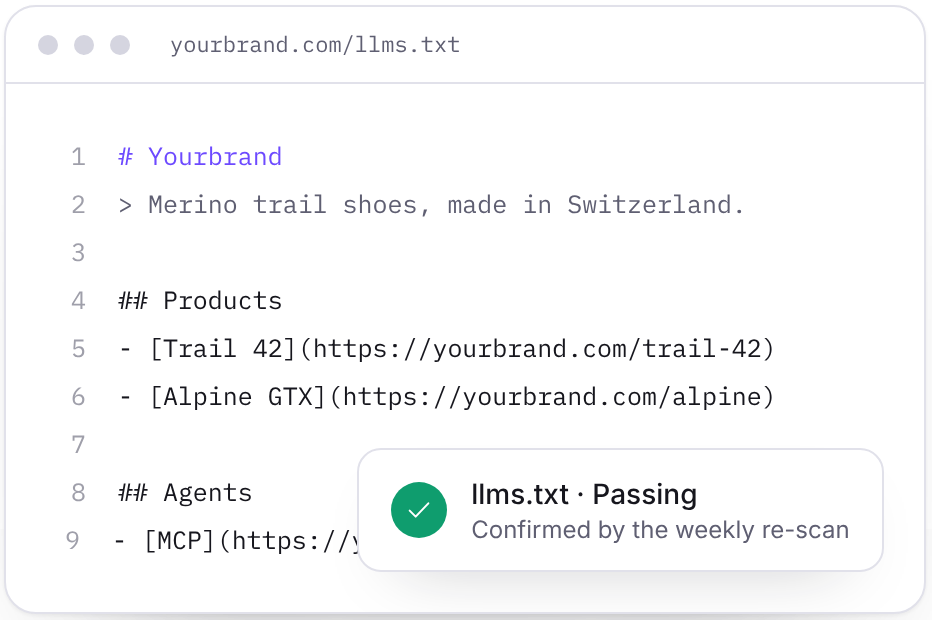
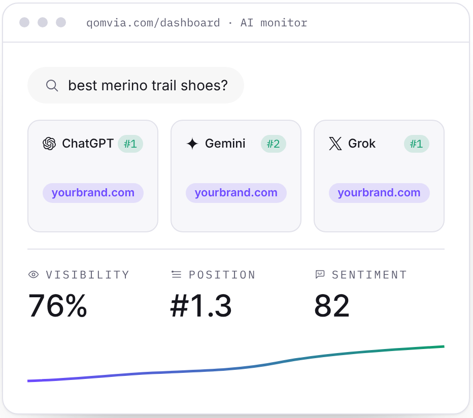
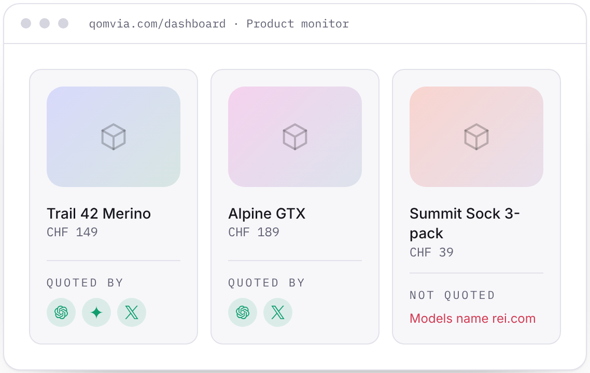
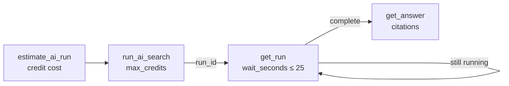

<p align="center">
  
</p>

<h1 align="center">Qomvia MCP servers</h1>

<p align="center">
  <strong>Let Claude, ChatGPT and Cursor shop, score websites and run your Qomvia monitors.</strong><br/>
  <a href="#quick-start">Quick start</a> ·
  <a href="#public-server">Public server</a> ·
  <a href="#account-server">Account server</a> ·
  <a href="#how-runs-work">How runs work</a> ·
  <a href="#qomvia-skill">Skill</a>
</p>

## Two servers, one for each job

<table>
  <tr>
    <td width="50%" valign="top">
      
      <h3>Public server</h3>
      <code>https://qomvia.com/api/mcp</code>
      <p>No sign-up, no key. Search shops, hold signed offers, check out on the merchant's page and score any website.</p>
      <p><b>10 tools</b> · Market and readiness</p>
    </td>
    <td width="50%" valign="top">
      
      <h3>Account server</h3>
      <code>https://qomvia.com/api/mcp/account</code>
      <p>Sign in with Qomvia. Work with your own sites: Site monitor, AI monitor, competitors and Product monitor.</p>
      <p><b>33 tools</b> · OAuth or API key</p>
    </td>
  </tr>
</table>

## Quick start

**ChatGPT and Claude.ai:** add a custom connector with the server URL. For the account server, sign in with Qomvia when asked.

| Server | Connector URL |
| --- | --- |
| Public | `https://qomvia.com/api/mcp` |
| Account | `https://qomvia.com/api/mcp/account` |

**Claude Code**

```sh
claude mcp add --transport http qomvia https://qomvia.com/api/mcp
```

**Cursor** · `~/.cursor/mcp.json`

```json
{ "mcpServers": { "qomvia": { "url": "https://qomvia.com/api/mcp" } } }
```

**Claude Desktop** · `claude_desktop_config.json`

```json
{ "mcpServers": { "qomvia": { "command": "npx", "args": ["-y", "mcp-remote", "https://qomvia.com/api/mcp"] } } }
```

For the account server in these clients, use an [API key](#api-key).

Then just ask:

> *"Find a bike helmet under CHF 100 that ships to Zürich."*
> *"Is example.com ready for AI agents?"*
> *"Run my tracked AI monitor questions and tell me where a competitor beats us."*

---

## Public server

`https://qomvia.com/api/mcp` · streamable HTTP · no authentication

<table>
  <tr>
    <td width="50%" valign="top">
      
      <h3>Buy</h3>
      <p>Ranked offers from listed shops, signed and held for 30 minutes. The buyer always pays on the merchant's own checkout.</p>
    </td>
    <td width="50%" valign="top">
      
      <h3>Check</h3>
      <p>The agent-readiness score of any website: 26 checks, graded 0–100 and A–F, with fixes for every failing check.</p>
    </td>
  </tr>
</table>

<details>
<summary><b>All 10 public tools</b></summary>

| Tool | What it does | Required |
| --- | --- | --- |
| `search_products` | Search listed shops; returns signed offers ranked by agent price and shipping. | `shipTo` |
| `get_offer` | Read an offer's merchant, product, prices, terms and expiry. | `offerId` |
| `extend_offer` | Extend an offer once by its hold time. | `offerId` |
| `create_checkout_session` | Open a checkout session with price, quantity and shipping. | `offerId` |
| `get_checkout_session` | Read a session's status, amounts and expiry. | `sessionId` |
| `complete_checkout` | Complete a session and return the merchant-hosted payment URL. | `sessionId` |
| `cancel_checkout_session` | Cancel an open session and release the offer. | `sessionId` |
| `get_ai_readiness_score` | Published score, grade, dimensions and check statuses. | `domain` |
| `scan_website` | Fresh read-only scan; one per domain per hour. | `domain` |
| `list_readiness_checks` | Rubric packs, dimensions, checks and fix guidance. | — |

</details>

<details>
<summary><b>Raw JSON-RPC examples</b></summary>

```sh
# Initialize
curl -s https://qomvia.com/api/mcp \
  -H 'content-type: application/json' \
  -d '{"jsonrpc":"2.0","id":1,"method":"initialize","params":{"protocolVersion":"2024-11-05","capabilities":{},"clientInfo":{"name":"example","version":"1.0"}}}'

# List tools
curl -s https://qomvia.com/api/mcp \
  -H 'content-type: application/json' \
  -d '{"jsonrpc":"2.0","id":2,"method":"tools/list","params":{}}'

# Score a site
curl -s https://qomvia.com/api/mcp \
  -H 'content-type: application/json' \
  -d '{"jsonrpc":"2.0","id":3,"method":"tools/call","params":{"name":"get_ai_readiness_score","arguments":{"domain":"example.com"}}}'
```

An optional `Authorization: Bearer qva_…` agent key raises market limits.

</details>

---

## Account server

`https://qomvia.com/api/mcp/account` · streamable HTTP · OAuth 2.1 or API key

Your sites, your monitors, your credits. Every tool respects the same plans, limits and site access as the Qomvia dashboard.

### Site monitor

<table>
  <tr>
    <td width="50%"></td>
    <td width="50%"></td>
  </tr>
</table>

Read the latest report, get a copy-ready fix prompt for any failing check, start a rescan and wait for it.

> *"What's failing on my site, and give me a prompt to fix the worst one."*

<details>
<summary><b>Site monitor tools</b></summary>

| Tool | What it does | Scope |
| --- | --- | --- |
| `get_site_report` | Latest score, findings and fixes. | `sites:read` |
| `get_fix_prompt` | Copy-ready prompt for a failing or partial check. | `sites:read` |
| `start_site_scan` | Start a fresh scan; limited by cooldown. | `sites:scan` |
| `get_site_scan` | Read the latest scan and wait briefly for completion. | `sites:read` |

</details>

### AI monitor

<table>
  <tr>
    <td width="50%"></td>
    <td width="50%" valign="top">
      <p>Add the questions your buyers ask, run them across ChatGPT, Gemini, Grok and more, and read who gets named and cited.</p>
      <blockquote><i>"Add these five questions to my Weekly tracker, run them now and show me the answers."</i></blockquote>
    </td>
  </tr>
</table>

<details>
<summary><b>AI monitor tools</b></summary>

| Tool | What it does | Scope |
| --- | --- | --- |
| `get_ai_monitor` | Balance, tracked questions, providers and latest runs. | `monitor:read` |
| `list_phrases` | List tracked, research or archived questions. | `monitor:read` |
| `add_phrases` | Save questions, optionally to the Weekly tracker. | `monitor:write` |
| `update_phrases` | Track, pause, archive, restore, tag or organise questions. | `monitor:write` |
| `estimate_ai_run` | Credit estimate for a run, without starting it. | `monitor:read` |
| `run_ai_search` | Queue fresh AI answers for tracked or selected questions. | `monitor:run` |
| `ask_ai` | Ask the AI models one fresh question. | `monitor:run` |
| `get_run` | Read run results; optionally wait for progress. | `monitor:read` |
| `list_runs` | Recent runs for a site. | `monitor:read` |
| `get_answer` | A full AI answer with its citations. | `monitor:read` |

</details>

### Competitors

<table>
  <tr>
    <td width="50%"></td>
    <td width="50%" valign="top">
      <p>See which rivals get named instead of you, where they win, and run head-to-head comparisons.</p>
      <blockquote><i>"Which questions does my top competitor win, and why?"</i></blockquote>
    </td>
  </tr>
</table>

<details>
<summary><b>Competitor tools</b></summary>

| Tool | What it does | Scope |
| --- | --- | --- |
| `list_competitors` | Tracked and listed rival domains. | `competitors:read` |
| `get_competitor` | Rival profile, answer evidence and head-to-head summary. | `competitors:read` |
| `get_competitor_gaps` | Questions where a rival wins, is named or is absent. | `competitors:read` |
| `search_mentions` | Search measured answers for a rival, domain or topic. | `competitors:read` |
| `add_competitor` | Add a rival domain, optionally tracking it. | `competitors:write` |
| `update_competitor` | Track, untrack, dismiss, restore or rename a rival. | `competitors:write` |
| `investigate_competitor` | Start a public read-only scan of a tracked rival. | `competitors:run` |
| `run_head_to_head` | Start a head-to-head comparison. | `competitors:run` |

</details>

### Product monitor

<table>
  <tr>
    <td width="50%"></td>
    <td width="50%" valign="top">
      <p>Track your products in AI answers: which ones get quoted, by which model, and which ones a rival takes.</p>
      <blockquote><i>"Which of my products are never quoted? Add a question for each."</i></blockquote>
    </td>
  </tr>
</table>

<details>
<summary><b>Product monitor tools</b></summary>

| Tool | What it does | Scope |
| --- | --- | --- |
| `list_products` | Catalogue products, tracking state and capacity. | `products:read` |
| `get_product_visibility` | Latest product answers and run status. | `products:read` |
| `add_product` | Add and track a product. | `products:write` |
| `set_tracked_products` | Smart, top-by-price or explicit tracking. | `products:write` |
| `remove_product` | Remove a product and its questions. | `products:write` |
| `save_product_question` | Create or update a product question. | `products:write` |
| `remove_product_question` | Remove a product question. | `products:write` |
| `estimate_product_run` | Credit estimate for a product run. | `products:read` |
| `run_product_check` | Start a product visibility run. | `products:run` |

</details>

<details>
<summary><b>Account tools</b></summary>

| Tool | What it does | Scope |
| --- | --- | --- |
| `whoami` | The account and permissions behind this connection. | `sites:read` |
| `list_sites` | Sites this connection can reach. | `sites:read` |

</details>

---

## How runs work



- **Estimate first.** `estimate_ai_run` and `estimate_product_run` show the cost. Runs that spend credits need `max_credits` and stop if the estimate is higher.
- **Poll, don't guess.** Runs return a `run_id` at once; `get_run` waits up to 25 seconds per call.
- **Retry safely.** Send an `idempotency_key` (8–100 letters, digits, `_` or `-`); a retry within 24 hours returns the original run and is never charged twice.
- **Limits per connection:** 120 reads, 30 writes and 10 runs per minute.

---

## Sign in

### OAuth (ChatGPT, Claude.ai)

Add `https://qomvia.com/api/mcp/account` as a custom connector. The client registers itself, you sign in with Qomvia and choose what it may do and which sites it sees. Disconnect it any time in your Qomvia dashboard.

- OAuth 2.1 authorization code with PKCE (S256), public clients, dynamic client registration.
- Access tokens last 1 hour; refresh tokens rotate and last 30 days.
- Metadata: [authorization server](https://qomvia.com/.well-known/oauth-authorization-server) · [protected resource](https://qomvia.com/.well-known/oauth-protected-resource/api/mcp/account)

### API key

For Claude Code, Cursor, Claude Desktop and scripts. Create a key in your Qomvia dashboard. Keys start with `qvk_live_`, can be limited to chosen sites, expire after 30, 90 or 365 days or never, and can be revoked at any time.

```sh
claude mcp add --transport http qomvia-account https://qomvia.com/api/mcp/account \
  --header "Authorization: Bearer $QOMVIA_API_KEY"
```

```json
{
  "mcpServers": {
    "qomvia-account": {
      "type": "http",
      "url": "https://qomvia.com/api/mcp/account",
      "headers": { "Authorization": "Bearer ${QOMVIA_API_KEY}" }
    }
  }
}
```

Keys are only accepted in the `Authorization` (or `X-API-Key`) header, never in a URL.

### Permissions

OAuth and API keys share the same presets:

| Preset | What the agent can do | Scopes |
| --- | --- | --- |
| **Read only** | Read reports, answers, rivals and products | `sites:read` `monitor:read` `competitors:read` `products:read` |
| **Read and edit** | Also add questions, rivals and products | + `monitor:write` `competitors:write` `products:write` |
| **Full** | Also start scans and runs that spend credits | + `sites:scan` `monitor:run` `competitors:run` `products:run` |

---

## Qomvia skill

A downloadable Agent Skill for Claude and ChatGPT that teaches agents the account workflow: check access, estimate, run, poll and read mention rate, citation rate, rank and share of voice correctly.

**[Download qomvia.zip](https://qomvia.com/skills/qomvia.zip)** · [Agent Skills index](https://qomvia.com/.well-known/agent-skills/index.json)

---

[qomvia.com/mcp](https://qomvia.com/mcp) · [Authentication](https://qomvia.com/.well-known/auth.md) · [Discovery](https://qomvia.com/.well-known/mcp.json) · [Registry descriptor](../server.json) · [REST API](../api/README.md)
